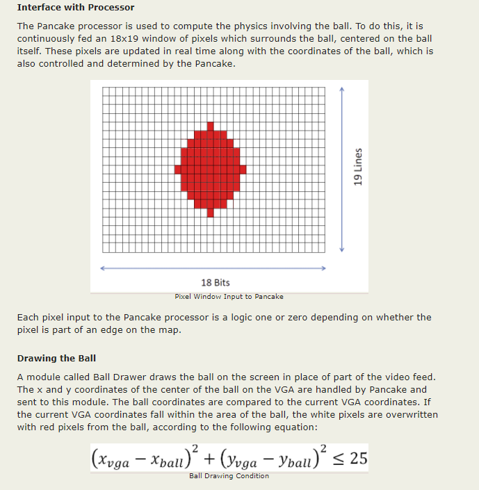

# Lab 3: Bouncing Ball
Programed the FPGA to display a "bouncing ball" on a 800x600 Video Graphics Array (VGA) monitor.


## Modifications:
Modified file located at (.\vgaball\vgaball.srcs\sources_1\new\ball.vhd)
* Changed the size of the ball. (8 --> 16)
    ```diff
    - CONSTANT size : INTEGER := 8;

    + CONSTANT size : INTEGER := 16;
    ```

* Changed the color of the ball. (red --> blue)
    ```diff
    - red <= '1';
	- green <= NOT ball_on;
	- blue  <= NOT ball_on;

    + red <= NOT ball_on;
	+ green <= NOT ball_on;
	+ blue  <= '1';
    ```

* Changed the shape of the ball. (square --> circle*)
    ```diff
    - IF (pixel_col >= ball_x - size) AND
	-    (pixel_col <= ball_x + size) AND
	-    (pixel_row >= ball_y - size) AND
	-    (pixel_row <= ball_y + size) THEN
	-    ball_on <= '1';
	- ELSE
	-    ball_on <= '0';
	- END IF;

    + VARIABLE x : INTEGER;
	+ VARIABLE y : INTEGER;
    + x := CONV_INTEGER(pixel_col) - CONV_INTEGER(ball_x);
	+ y := CONV_INTEGER(pixel_row) - CONV_INTEGER(ball_y);
	+    
	+ IF ((x * x + y * y) <= (size * size)) THEN
	+    ball_on <= '1';
	+ ELSE
	+    ball_on <= '0';
	+ END IF;
    ```

* Added horizontal motion.
    ```diff
    + SIGNAL ball_x_motion : STD_LOGIC_VECTOR(10 DOWNTO 0) := "00000000100";
    +
    + IF ball_x + size >= 800 THEN
    +    ball_x_motion <= "11111111100";
	+ ELSIF ball_x <= size THEN
	+    ball_x_motion <= "00000000100";s
    + END IF;
    +
    + ball_x <= ball_x + ball_x_motion;
    ```


---
## Reference:

https://people.ece.cornell.edu/land/courses/ece5760/FinalProjects/s2013/cwf38_as889_mao65/index.htm