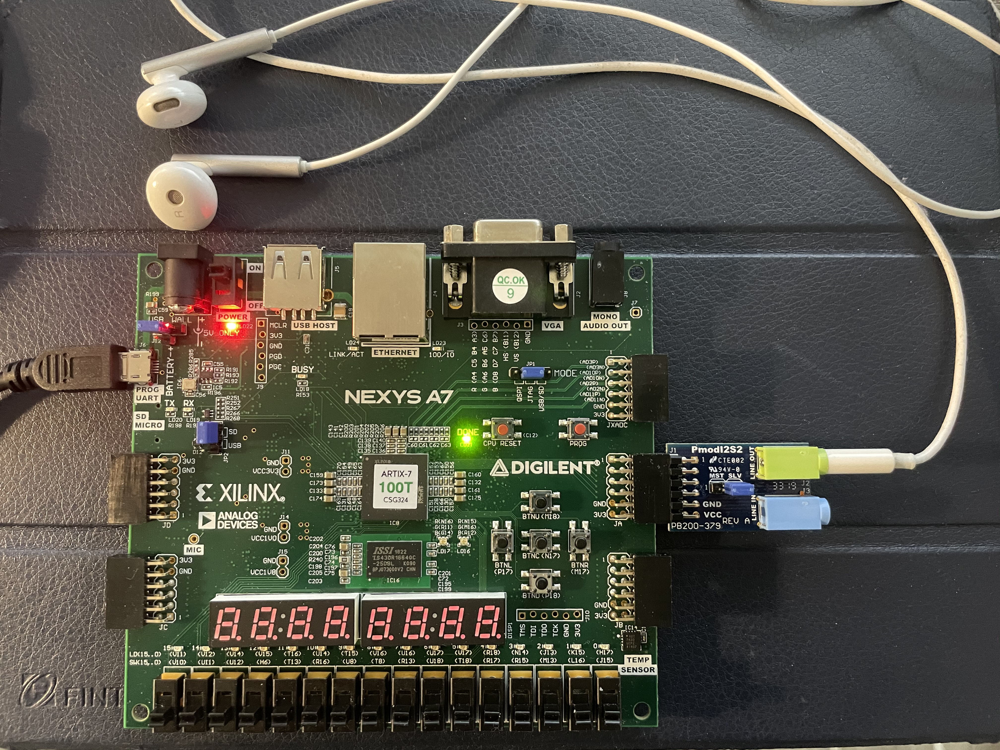

# Lab 5: DAC Siren
Programed the FPGA to generate a wailing audio siren using a digital-to-analog (DAC) converter with a headphone.



## Modifications:
* Changed the upper and lower tone limits. (Added a square wave when the upper push button (BTNU) is depressed)
    * Modified file located at (.\siren\siren.srcs\constrs_1\new\siren.xdc)
    ```diff
    + set_property -dict { PACKAGE_PIN M18   IOSTANDARD LVCMOS33 } [get_ports { square }];
    ```
    * Modified file located at (.\siren\siren.srcs\sources_1\new\siren.vhd)
    ```diff
    ENTITY
    + square : IN STD_LOGIC;

    ARCHITECTURE
        COMPONENT wail
    +    button_press: IN STD_LOGIC;

        w1 : wail PORT MAP
    +    button_press => square,
    ```
    * Modified file located at (.\siren\siren.srcs\sources_1\new\wail.vhd)
    ```diff
    ENTITY
    + button_press : IN STD_LOGIC;

    ARCHITECTURE
        COMPONENT tone
    +    button_press : IN STD_LOGIC;

        tgen : tone PORT MAP
    +    button_press => button_press,
    ```
    * Modified file located at (.\siren\siren.srcs\sources_1\new\tone.vhd)
    ```diff
    ENTITY
    + button_press : IN STD_LOGIC;

    ARCHITECTURE
    + SIGNAL data_sq: SIGNED (15 DOWNTO 0);
	+ SIGNAL data_tri: SIGNED (15 DOWNTO 0);

    + WITH quad SELECT
    + data_sq <= TO_SIGNED(16383, 16) WHEN "00",
    +        TO_SIGNED(-16383, 16) WHEN "01",
    +        TO_SIGNED(16383, 16) WHEN "10",
    +        TO_SIGNED(-16383, 16) WHEN OTHERS;
            
    - WITH quad SELECT
	- data <= index WHEN "00",
	-        16383 - index WHEN "01",
	-        0 - index WHEN "10",
	-        index - 16383 WHEN OTHERS;

    + WITH quad SELECT
    + data_tri <= index WHEN "00",
    +        16383 - index WHEN "01",
    +        0 - index WHEN "10",
    +        index - 16383 WHEN OTHERS;

    + wave_select : PROCESS
    + BEGIN
	+    IF button_press = '1' THEN
    +        data <= data_sq;       
    +    ELSE
    +        data <= data_tri;
    +    END IF;     
    + END PROCESS;
    ```

* Changed the wailing speed.
    * Modified file located at (.\siren\siren.srcs\constrs_1\new\siren.xdc)
    ```diff
    + set_property -dict { PACKAGE_PIN J15   IOSTANDARD LVCMOS33 } [get_ports { SW0 }];
    + set_property -dict { PACKAGE_PIN L16   IOSTANDARD LVCMOS33 } [get_ports { SW1 }];
    + set_property -dict { PACKAGE_PIN M13   IOSTANDARD LVCMOS33 } [get_ports { SW2 }];
    + set_property -dict { PACKAGE_PIN R15   IOSTANDARD LVCMOS33 } [get_ports { SW3 }];
    + set_property -dict { PACKAGE_PIN R17   IOSTANDARD LVCMOS33 } [get_ports { SW4 }];
    + set_property -dict { PACKAGE_PIN T18   IOSTANDARD LVCMOS33 } [get_ports { SW5 }];
    + set_property -dict { PACKAGE_PIN U18   IOSTANDARD LVCMOS33 } [get_ports { SW6 }];
    + set_property -dict { PACKAGE_PIN R13   IOSTANDARD LVCMOS33 } [get_ports { SW7 }];
    ```
    * Modified file located at (.\siren\siren.srcs\sources_1\new\siren.vhd)
    ```diff
    ENTITY
    + SW0 : IN STD_LOGIC;
	+ SW1 : IN STD_LOGIC;
	+ SW2 : IN STD_LOGIC;
	+ SW3 : IN STD_LOGIC;
	+ SW4 : IN STD_LOGIC;
	+ SW5 : IN STD_LOGIC;
	+ SW6 : IN STD_LOGIC;
	+ SW7 : IN STD_LOGIC;

    ARCHITECTURE
    - CONSTANT wail_speed : UNSIGNED (7 DOWNTO 0) := to_unsigned (8, 8);
    + SIGNAL wail_speed : UNSIGNED (7 DOWNTO 0) := to_unsigned (8, 8);

    + wail_speed(0) <= SW0;
	+ wail_speed(1) <= SW1;
	+ wail_speed(2) <= SW2;
	+ wail_speed(3) <= SW3;
	+ wail_speed(4) <= SW4;
	+ wail_speed(5) <= SW5;
	+ wail_speed(6) <= SW6;
	+ wail_speed(7) <= SW7;
    ```

* Added a second wail to the right channel.
    * Modified file located at (.\siren\siren.srcs\sources_1\new\siren.vhd)
    ```diff
    + w2 : wail
	+ PORT MAP(
	+	lo_pitch => hi_tone, -- instantiate wailing siren
	+	hi_pitch => lo_tone, 
	+	wspeed => wail_speed, 
	+	wclk => slo_clk, 
	+	audio_clk => audio_clk, 
	+	button_press => square,
	+	audio_data => data_R
	+ );

    - data_R <= data_L;
    ```
