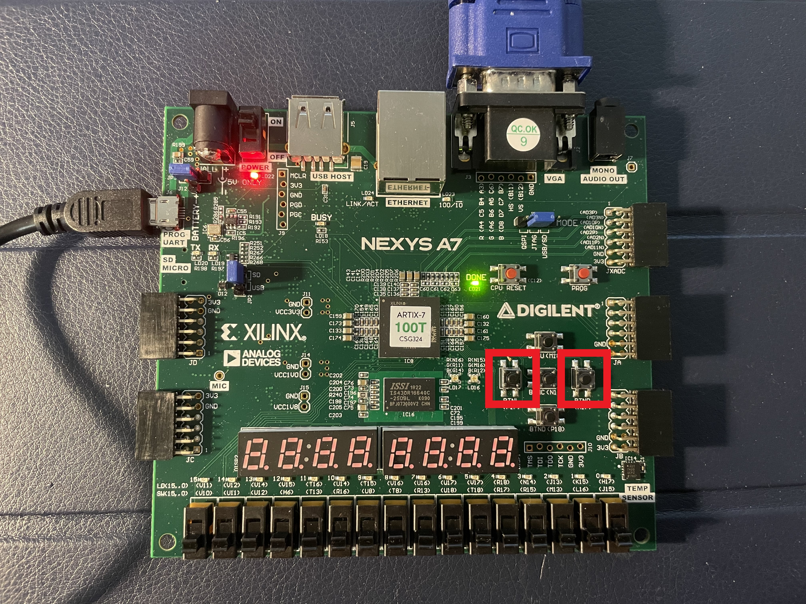

# Lab 6: Video Game PONG
Extended the FPGA code developed in Lab 3 (Bouncing Ball) to build a PONG game using a 800x600 Video Graphics Array display.


## Modifications:
* Changed control mode.
    * Played the game without using potentiometer with an analog-to-digital converter. Used BTNL and BTNR buttons on the board to control the motion of the bat.
    * Modified file located at (.\pong\pong.srcs\constrs_1\new\pong.xdc)
    ```diff
    + set_property -dict { PACKAGE_PIN P17 IOSTANDARD LVCMOS33 } [get_ports { btnl }];
    + set_property -dict { PACKAGE_PIN M17 IOSTANDARD LVCMOS33 } [get_ports { btnr }];
    ```
    * Modified file located at (.\pong\pong.srcs\sources_1\new\pong.vhd)
    ```diff
    ENTITY
    + btnr : IN STD_LOGIC;
    + btn0 : IN STD_LOGIC;

    ARCHITECTURE
    + SIGNAL count : STD_LOGIC_VECTOR (20 DOWNTO 0); --set the speed of the moving bat.

    + pos : PROCESS (clk_in) is
    + BEGIN
    +    if rising_edge(clk_in) then
    +        count <= count + 1;
    +        IF (btnl = '1' and count = 0 and batpos > 0) THEN
    +            batpos <= batpos - 10;
    +        ELSIF (btnr = '1' and count = 0 and batpos < 800) THEN
    +            batpos <= batpos + 10;
    +        END IF;
    +    end if;
    + END PROCESS;
    ```
    

* Changed the ball speed by using side switches.
    * Modified file located at (.\pong\pong.srcs\constrs_1\new\pong.xdc)
    ```diff
    + set_property -dict { PACKAGE_PIN J15   IOSTANDARD LVCMOS33 } [get_ports { SW[0] }];
    + set_property -dict { PACKAGE_PIN L16   IOSTANDARD LVCMOS33 } [get_ports { SW[1] }];
    + set_property -dict { PACKAGE_PIN M13   IOSTANDARD LVCMOS33 } [get_ports { SW[2] }];
    + set_property -dict { PACKAGE_PIN R15   IOSTANDARD LVCMOS33 } [get_ports { SW[3] }];
    + set_property -dict { PACKAGE_PIN R17   IOSTANDARD LVCMOS33 } [get_ports { SW[4] }];
    ```
    * Modified file located at (.\pong\pong.srcs\sources_1\new\pong.vhd)
    ```diff
    ENTITY
    + SW : IN STD_LOGIC_VECTOR (4 DOWNTO 0);

    ARCHITECTURE
        COMPONENT bat_n_ball
    +    SW : IN STD_LOGIC_VECTOR (4 DOWNTO 0);
        add_bb : bat_n_ball PORT MAP
    +    SW => SW,
    ```
    * Modified file located at (.\pong\pong.srcs\sources_1\new\bat_n_ball.vhd)
    ```diff
    ENTITY
    + SW : IN STD_LOGIC_VECTOR (4 DOWNTO 0);

    ARCHITECTURE
    - CONSTANT ball_speed : STD_LOGIC_VECTOR (10 DOWNTO 0) := CONV_STD_LOGIC_VECTOR (6, 11);
    + SIGNAL ball_speed : STD_LOGIC_VECTOR (10 DOWNTO 0);

    + ball_speed <= (10 DOWNTO SW'length => '0') & SW;
    ```

* Changed the bat width.
    * Doubled the width at beginning and decreased by 10% each time hitting the ball.
    * Modified file located at (.\pong\pong.srcs\sources_1\new\bat_n_ball.vhd)
    ```diff
    - CONSTANT bat_w : INTEGER := 20;
    + SIGNAL bat_w : INTEGER := 40;

    + bat_w <= 40;

    + bat_w <= bat_w *9/10;
    ```

* Added a counter.
    * Added leddac16.vhd file from lab 4.
    * Modified file located at (.\pong\pong.srcs\constrs_1\new\pong.xdc)
    ```diff
    + set_property -dict {PACKAGE_PIN L18 IOSTANDARD LVCMOS33} [get_ports {SEG7_seg[0]}]
    + set_property -dict {PACKAGE_PIN T11 IOSTANDARD LVCMOS33} [get_ports {SEG7_seg[1]}]
    + set_property -dict {PACKAGE_PIN P15 IOSTANDARD LVCMOS33} [get_ports {SEG7_seg[2]}]
    + set_property -dict {PACKAGE_PIN K13 IOSTANDARD LVCMOS33} [get_ports {SEG7_seg[3]}]
    + set_property -dict {PACKAGE_PIN K16 IOSTANDARD LVCMOS33} [get_ports {SEG7_seg[4]}]
    + set_property -dict {PACKAGE_PIN R10 IOSTANDARD LVCMOS33} [get_ports {SEG7_seg[5]}]
    + set_property -dict {PACKAGE_PIN T10 IOSTANDARD LVCMOS33} [get_ports {SEG7_seg[6]}]

    + set_property -dict {PACKAGE_PIN U13 IOSTANDARD LVCMOS33} [get_ports {SEG7_anode[0]}]
    + set_property -dict {PACKAGE_PIN K2 IOSTANDARD LVCMOS33} [get_ports {SEG7_anode[1]}]
    + set_property -dict {PACKAGE_PIN T14 IOSTANDARD LVCMOS33} [get_ports {SEG7_anode[2]}]
    + set_property -dict {PACKAGE_PIN P14 IOSTANDARD LVCMOS33} [get_ports {SEG7_anode[3]}]
    ```
    * Modified file located at (.\pong\pong.srcs\sources_1\new\pong.vhd)
    ```diff
    ENTITY
    + SEG7_anode : OUT STD_LOGIC_VECTOR (3 DOWNTO 0);
    + SEG7_seg : OUT STD_LOGIC_VECTOR (6 DOWNTO 0);

    ARCHITECTURE
    + SIGNAL display : std_logic_vector (15 DOWNTO 0);
    + SIGNAL led_mpx : STD_LOGIC_VECTOR (1 DOWNTO 0);

        COMPONENT bat_n_ball
    +    hits : OUT STD_LOGIC_VECTOR (15 DOWNTO 0);

    +   COMPONENT leddec16 IS
    +    PORT (
    +        dig : IN STD_LOGIC_VECTOR (1 DOWNTO 0);
    +        data : IN STD_LOGIC_VECTOR (15 DOWNTO 0);
    +        anode : OUT STD_LOGIC_VECTOR (3 DOWNTO 0);
    +        seg : OUT STD_LOGIC_VECTOR (6 DOWNTO 0)
    +    );
    +   END COMPONENT;

        add_bb : bat_n_ball PORT MAP
    +    hits => display

    +   ed1 : leddec16 PORT MAP(
    +    dig => led_mpx, data => display, 
    +    anode => SEG7_anode, seg => SEG7_seg
    + );
    ```
    * Modified file located at (.\pong\pong.srcs\sources_1\new\bat_n_ball.vhd)
    ```diff
    ENTITY
    + hits: OUT STD_LOGIC_VECTOR (15 DOWNTO 0);

    ARCHITECTURE
    + SIGNAL hitcount : STD_LOGIC_VECTOR(15 DOWNTO 0);
    + SIGNAL stop_dbl_hit : STD_LOGIC;

    + hitcount <= CONV_STD_LOGIC_VECTOR(0, 16);
    + stop_dbl_hit <= '0';

    IF (ball_x + bsize/2) >= (bat_x - bat_w) AND
       (ball_x - bsize/2) <= (bat_x + bat_w) AND
       (ball_y + bsize/2) >= (bat_y - bat_h) AND
       (ball_y - bsize/2) <= (bat_y + bat_h) AND
    +  stop_dbl_hit = '0' THEN
            ball_y_motion <= (NOT ball_speed) + 1;
            bat_w <= bat_w *9/10;
    +       hitcount <= hitcount + 1;
    +       hits <= hitcount;
    +       stop_dbl_hit <= '1';
    END IF;
    ```

